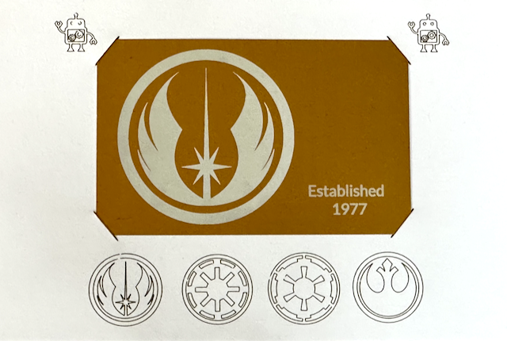

---
Tutorial Outline

This is a highly detailed step-by-step outline designed to guide the student through the process of preparing jobs as well as 
operating the F1/F1 Ultra laser.

---
# Class Outline

  - Quick introduction and demonstration of laser
  - Safety Training
  - Software introduction
  - Material Test Grid construction
  - Hands-on operation - each student will operate.

---
# Intro to the F1 lasers

  - we currently have 2 F1 lasers, with many common attributes
  - they are a "galvo" laser - using mirrors that can quickly move the beam accurately w/ a gantry
  - they can engrave and cut a variety of light organic materials and can mark or etch some metals
  - the visible light lasers can oxidize the surface of some metals (stainless steel, titanium) to
    to produce color effects (blues, greens, reds, warm browns.)
  - very fine detail is possible

 --- 
## F1 laser specifics

 - this is a 10W diode laser (blue) and a 2W infrared laser (green)
   - the diode laser can mark or etch many materials, and can cut many organics
   - the IR laser can mark (and maybe etch) metals and stone, but cannot cut them.
 - it has a 4 inch square work area, with a removable base
 - it has its own attached air cleaner, and is portable

---
## F1 Ultra laser specifics

  - this is a 20W diode laser (blue) and a 20W fiber IR laser (green)
    - the diode laser can mark or etch many materials, and can cut many organics
    - the fiber laser can mark or etch many metals, and can cut some metals,
      but it takes time. 
      - We've managed to cut aluminum, brass, and stainless steel so far.
      - we have not been able to cut copper or bronze 
    - not fast, but it can emboss stone and brass
  - it has a 6 inch square work area, with a fixed base
  - there is an internal camera to assist in design/material alignment
  - it is currently vented through our ducting system

---
# Materials

  - visible lasers are effective on paper, cardboard, acrylic, light wood, stone, some metals
  - IR/fiber lasers are effective on stone and many metals: copper, brass, anodized aluminum, 
    stainless steel (and apparently gold and silver!)

---
# Safety

  - The energy in these lasers can permanently and irreversibly damage your retinas if not operated safely.
  - both direct and diffuse reflection of this beam can do damage, faster than you can react
  - when operated behind the filter, with the lid closed, it's a Class 1 laser and will not hurt you.
  - without the filter, it's a Class 4 laser, and requires protective eyewear or shielding for any who could be exposed.

---
# Safety Policy

  - It is against studio policy to defeat the safety switch and operate this as a Class 4 laser
    when there are other people in the studio who could be exposed. 
  - It is against studio policy to operate the laser in a Class 4 mode without using appropriate 
    shielding and/or protective eyewear even when alone. 
  - You should inform the studio monitor of your desire to operate the laser in this manner, and they 
    can make the determination as to whether what you want to do can be done safely. 
  - the laser should not be left unattended while operating.

---
# Setup and laser orientation

  - laser turned on
  - exhaust duct is attached depending on laser, exhaust fans all turned on
  - XCS software launched and connected to laser
    - all device settings have safety switches ENABLED
  - lid slides up to access the working area, slides down to completely enclose it.

---  
## F1 Laser
  
  - air purifier is connected, and sits near the laser (may be ducted outside too)
  - top left button is emergency shutoff - if depressed it won't power up, turn button to release the lock.
  - top right button is used for focusing and for starting a job
  - confirm settings: all safety toggles on AND IR laser preheat on.
  
---
## F1 Ultra Laser
  - all buttons are on the right side of the machine
  - emergency shutoff is on top, if depressed the machine won't power up, turn button to release the lock.
  - bottom right button is the power button
  - manual focusing and starting a job is done by a touchpad
  
---
# XCS Interface

XCS is the Xtool Creative Space software that drives the laser. 
We try to use the most recent version on the Windows machines in the lab.

---
## Operating Modes

  These are the modes available in both versions of XCS, with callouts specific for each machine.
  
  - Process on flat surface - laser material is a flat object
  - Use Rotary Attachment or Conveor - we don't currently have one
  - Curved Material (F1 Ultra) - allows for 10cm variation with tangent angle <= 45 degrees
    - see [Process a Curved Material with XCS on the Computer](https://support.xtool.com/article/1324)
  - Embossment (F1 Ultra) - carve into a thick material layer by layer, creating a 3D effect
    - see [Start Laser Embossing with XCS on the Computer](https://support.xtool.com/article/1325)
  
---
## XCS 2.12.1 or higher

The newer versions of XCS support both the F1 and F1 Ultra lasers

  - you need to open a project (either new, existing from computer, or from online) first
    - multiple projects can be open, each resides in a separate tab
  - top tool bar is  file operations, settings, focus, camera, and material setting name.
  - left tool bar is the tools for placing objects on a Canvas
  - layers -  the bottom left corner, for grouping items with similar settings
  - right tool bar contain the laser settings (type, power, speed, etc)
  - when objects are selected, tools to manipulate them are enabled at the top of the canvas
  
---
# Artwork Supported

  - vector files: SVG is the most typical
  - raster files: JPEG, PNG, GIF are typical
  - vector files can be manipulated after import
  - raster images can be scaled, traced, and filtered after import
  
---
# Laser settings

  - vector scoring - draw the outline of the objects on canvas - usually very quickly
    - variables: power, speed, passes (limited number)
  - vector engraving - draw and fill the objects on canvas - measured in lines/cm so slower
    - variables: power, speed, passes, lines/cm
  - vector cut - when you want to cut through the material
    - variables: power, speed, passes (you get numbers as high as 10K passes in cut mode)
  - raster engrave - when you want to "print" a raster image using the laser
  - variables: dot duration, power, DPI, passes, bitmap mode, engraving mode
  - image embossing - power, speed, dpi
    
---
# Material settings

  - Xtool material settings page is a good place to start
    - [Material Settings Page](https://www.xtool.com/pages/material-settings) 
  - XCS 2 supports  online settings, but they're not as succinct. 
    - select the material settings on the top right, and navigate to more from there
    - or you can directly access the site [EasySet Library](https://easyset.xtool.com)
  - presets can be selected, but should be confirmed for your material
  - constructing a material test grid is a good way to quickly zero in on appropriate settings
  - you can only adjust by two variables - power and speed (or dot duration and speed for bitmap)
  
---
# Material testing

## Standard Settings for most jobs:

### XCS 2.*

  - selection does not matter, values are in the top tool bar, left-to-right:
    - `Process on flat surface`
    - `User Defined Materials` on the right to enable manual settings
    - set `thickness` OR use `automeasure` to focus or manually focus
    - select `Refresh background` with the camera icon (don't do this until ready for framing.)
      
---
## Building a material test for paper
	
  - draw a circle or rectangle on canvas, typically around 5-10 mm
  - with object selected:
    - set initial mode (score) and laser (blue light), 
      - F1 power to 50%, speed to 1000 mm/s
      - F1 Ultra power ot 25%, speed to 1000 mm/s
    - from the toolbar, select Array, then Material Array
    - set power/speed based upon the material you're testing and the laser, 
      - F1: 10-50% @10-50 mm/s; F1 Ultra 10-50% @20-80 mm/s
    - hit OK to place the array on the canvas
    - you can now move the array as a single group as you see fit
    
---
## Using layers to make the test more legible

  - the material test grid is a group.
  - use the top toolbar 'ungroup' command to remove that grouping
  - click outside the area to un-select the objects
  - draw a selection box around the left hand text (NOT the grid of objects)
  - with the layer control, select the "Move to" button and select one of the unused colors
    - this will create a new layer named "Layer 2"
  - repeat this for the top and bottom text and labels, moving them to the same "Layer 2"
  - select the new layer and rename it "text labels"

---
## Adjust layer settings

  -Optional:  with the new layer "text labels" selected, adjust the laser settings on the right panel:
  - `output` radio button should be selected
  - `processing type`: engrave
  - `setting`: manual setting
  - `Laser Type`: Blue light
  - `Power`: F1 75%, F1 Ultra TBD <<<<<<
  - `Speed`: F1 150 mm/s, F1 Ultra TBD <<<<<<<
  - `Pass`: 1
  - `Lines per cm`: 220
  - `Engraving Mode`: Bidirectional
  
---
## Check framing and save the project 

  - load your test material (here a sheet of thick paper)
  - focus the laser using the top-right knob to align the red & blue dots
  - select the Framing button - this will draw a low-power outline of the object on the material
  - select and move the object on canvas while observing its location on the material
  - select Stop Framing once position is as desired.
  - using the top "Folder" menu, select `Save As` and give it a file name
  - in the example files, I called it `material-test-65lb-paper.xcs`
  
---
### Using the F1 Ultra camera

 - make sure the laser is focused on the material
 - close the lid and select the "camera" icon to `Refresh background`
 - now you can directly place the design on the material. Use of cursor keys to nudge the selected
   design is possible. if the material is not perfectly square you can use the angle control to   
   adjust its relative angle. 
  
---
## Run the Project

  - Select the Process button, this takes you to the Preview page
  - if the job looks correct, make sure that the laser lid is closed and press Start
  
---
### for the F1
  - the knob on the top right side of the laser should be blinking, once pressed it will start running the job.
  - if you accidentally hit the emergency shutoff button on the top left, you'll have to reconnect and restart the job.

---
### for the F1 Ultra
  - once the job is displayed on the touch screen, press the long button on the bottom of the panel
  - if you want to run the job again, press the button twice.
  - it is much harder to hit the emergency shutoff accidentally
  
---
## Evaluate material grid
  
  - when the job is finished, it's safe to open the lid and examine the results
  - take note of the desired settings: you need to find for our use:
    - a setting which marks the paper legibly w/o cutting through
    - the minimal setting which cleanly cuts through the paper
  
---
## Material test for aluminum

  - we're going to use a preloaded one for that, it's the same process with these differences:
    - use vector engrave mode
    - use IR laser mode
      - technically we're just burning paint off of aluminum, so the visible laser could also be used. But the IR laser seems to burn it of more cleanly, and also works better on anodized material
    
---
# Example of importing SVG graphics

  - from a web browser (or Inkscape if installed)
    - open the file graphics-files/combo-example-01.svg
    - note what the image looks like on screen

  - in XCS
    - open a new project 
    - select Image import from the left toolbar and select the file graphics-files/combo-example-01.svg
    - note what the imported image looks like
    
---
##  Detailed difference notes:

In XCS 2, there has been positive changes on importing SVG images.

---
### SVG in XCS 2.*

  - paths are imported correctly
  - text is imported correctly, but the font specified may be substituted, even if installed
	- render text to paths before importing if you want to preserve a specific typeface
  - raster images import fine
  - objects are sorted into different layers based upon color, the SVG layer groups are ignored
	
---
# Setup and run the job

Using example files, we will run the jobs on the laser. The example looks like this:

---
## Using the Example Files

These project files are found in the `examples/` directory (one for each laser):
 `example-card-and-frame-metal-only.xcs` has only the metal parts enabled, and `example-card-and-frame-paper-only.xcs` has only the paper parts enabled.)
  
(Instructions for generating them at the end of this deck)

---
##  Common Laser Job steps
  - turn on the laser
  - open XCS, and wait for it to connect to the laser
  - verify that all safeties are on 
    - F1 only - ensure IR Preheat is on
    
---
## Setup Materials
  - open lid and place material on the bed
  - focus the laser
    - on F1 Ultra use the buttons on the touchpad or use Auto
    - on the F1 use the RHS knob
    - on both, make sure the red/blue dots converge on the material
---    
## open your project File
  - select the Framing button - and position either the material and/or your artwork to desired position
  - Stop Framing
  - on F1 Ultra you can use the Refresh (camera) button to get a live preview
  - Close the lid, being careful not to move your material.
    - some small/light materials may need to be taped down.
      
---
## Run the job
  - Select the `Process` button
  - if the contents of he Preview look okay, select the `Start` button in the top right of the window.
  - Press the knob on the upper right of the laser unit (or touch panel button on F1 Ultra)
  - wait for the job to complete
  - lift lid, remove material, and evaluate results
  - if you want to make another one at this time, you could,
    - at least if you've put some sort of alignment tape/jig on the bed
  -  otherwise cancel the Preview and go back to the canvas.
    
---
## Wrap Up
  - Repeat the above setups (setup materials and run the job) for the paper and metal project.
    - order does not matter, just make sure you have the correct job for the selected material!
   
  - when finished:
    - remove all materials
    - shut down laser
    - if there is dirt/dust around the laser, vacuum it up
    - if the fan at the rear of the laser is dirty, vacuum it too.

---
# Where to go from here

One area that we have not explored in this introductory material is using engraving into metals. 
While the results are promising, they take awhile - a small piece of metal can easily require 20 minutes.
This is due to the slow speeds required, as well as the fine level of detail (lines/cm or DPI).

Another area is the engraving of raster images. Here one must experiment with the dot duration and the speed, along with the
algorithm used to establish the dot pattern. Again, these take time to process, too much for a single intro class.

---
# Example Project

We're going to engrave an aluminum business card using imported vector graphics.  We'll add custom text to the card, then score and cut a paper backing to hold the card. 

---
## Build and Save aluminum job

Here are detailed steps to setup a job for aluminum card engraving.

---
### Prepare the project

  - prepare the project for the material size:
    - launch XCS and open project `template-files/f1_ultra/blank-project.XCS`
    - use "save as" to save this project to a new location with name of your choice
    - import the image file `templates/template-card-86x54.SVG`
    - place the image somewhere near the center of the frame (popup guides help alignment)
    - with the object select, in the RHS toolbar set the Object Setting to "Ignore"
    - rename the Layer name to "card outline"
    - save the project 
  
  ---
  ### Import Graphics

  - import a vector image into the Project
    - import one of the SVG graphics files from graphics-files/ directory
    - drag the selected object to within the card outline area and size it to fit using a corner
    - note that its on its own layer, you can rename this to "graphics"
    - change the object's settings to 'engrave' (if it's not already)
    
  ---
  ### Add Text Elements

  - add text directly
    - select the Text tool
      - this drops a big block of text ("HELLO") on your project and opens the Text panel 
    - set the text size (in points) to something that will fit in your space (14 pt in the example)
    - change the laser settings to 'engrave'
    - set the text value in this panel to something ("Established 1977" with a linebreak in the example.)
     - drag the selected text to a place you want it, and adjust the size to make it fit
    - set the typeface and style to something you like, and tweak settings to get what you want.

  ---
  ### Text Setting Details

  - leave Spacing and Leading set to 0 for default settings
    - Spacing is the space between characters (kerning)
    - Leading is the space between lines
    - both can be positive or negative values
  - set Alignment as you prefer
  - do NOT select "Weld" as this will permanently fix the text to these settings
  - it should already be in the "graphics" layer you previously created, but if not move it there.
    
  ---
  ### Additional Text Elements

  - add another text 
    - repeating the above actions, put another block of text with your name in it
    - format this text to fit into whatever space you want for the design
    - you might need to play with the leading (space beween lines)

---
### Adjust Layer Settings

  - adjust the layer settings
    - note that the two text blocks came in as "black" color, and are assigned to layer "black"
    - we already renamed it to "graphics", but rename the layer to "text and graphics" if you like

---
### Text/Graphics Layer Settings

- with this layer selected, use the Object Settings panel to these values:
  - `Output` selected
  - `Processing type`: engrave
  - `Setting`: User-defined
  - `Laser type`: Fiber IR
  - `Power`: 60%  (F1  100%)  (F1 Ultra 90%)
  - `Speed`: 1000 mm/s (F1 655 mm/s)  (F1 Ultra 2400 mm/s)
  - `Pass`: 1
  - `Lines per cm`: 220
  - `Engraving mode`: Bidirectional
  
- Save your Project
    
    
---
## Build and Save paper job

Here we'll build the paper frame backing. Much of the steps are similar to the prior job, so these instructions will concentrate more on the differences.

---
### Prepare Paper Background
  - prepare the project for the material size:
    - launch XCS and open project `template-files/f1_ultra/blank-project.XCS`
    - use Save As to save this project to a new location with name of your choice
    - select the rectangle tool, and draw out a rectangle on the canvas
    - in the upper toolbar:
      - select the "lock" button to unlock it the dimensions,
      - type in width 112.5mm, height 92.5mm, and
      - select the lock button again to lock the dimension (proportions)
    - set the Output Settings to Ignore. 

---
### Prepare Card Background

  - import the image template for the card to use for positioning
    - location `templates/template-card-86x54.svg`
  - place the image on the canvas inside of the larger rectangle, roughly centered.
  - move the smaller rectangle to the same layer as the larger one (probably Layer 1)
  - select that layer, rename it to "backgound" and ensure that Output settings are set to "ignore"
  - Save the project file

---
### Add desired graphics

  - setup graphics to be 'drawn' on the page
    - there are some SVG files in the `graphics-files/` directory, feel free to position ones you like on your canvas
      - keep in mind that we're going place the card into the frame so get things positioned the way you like.
    - once you've imported 1 graphic, move it to a new layer, and rename that layer "line graphics"
    - import any other graphics you want, keeping them in that same layer

---
### Correct Layer Settings

  - once finished, select the layer, and apply these settings to it:
    - `Object setting`: output
    - `Laser type`: Blue light
    - `Processing type`: score
    - `Power`:  (F1 45%) (F1 Ultra 50%)
    - `Speed`:  (F1 30 mm/s)  (F1 Ultra 40 mm/s)
    - `Pass`: 1
      
  ---
  ### Cut Lines

  - setup cut lines to be used to hold the card in the frame
    - using the Line tool, draw a line at a roughly 45° angle, across the top left corner of the inner rectangle
      - the intent is that this corner of the card fill slide into the line cut here, so position appropriately
      - bounding box should be approximately 10mm x 10mm.
    - move the selected line to a new layer, rename the layer to "cut lines"
    - select the line, copy/paste to create a duplicate and drag it over to the top right corner
  ---
  - in the top toolbar, select `Reflect` ->` Reflect horizontally`, then move the line to an appropriate position
  - copy/paste the top right line, drag to the lower right corner, use `Reflect` -> `Reflect vertically` and adjust position.
  - copy/paste the bottom right line, drag to the lower left corner, use `Reflect` -> `Reflect horizontally` and adjust
  - with the layer selected, set the Object settings to match:
    - `Object setting`: output
    - `Laser type`: Blue light
    - `Processing type`: cut
    - `Power`: (F1 40%) (F1 Ultra 65%)
    - `Speed`: (F1 10 mm/s) (F1 Ultra 30 mm/s)
    - `Pass`: 1
      
  ---
  - setup layer planning so that cut lines go last
    - in XCS 2.8, this has moved to the '...' following `Go to Process`
    - not necessary for this job, but can be useful for more complex jobs
    - without anything selected, in the RHS panel set `Processing Path` to `By Layer`.
    - rearrange the order of the layers in the layer palette by drawing the "cut lines" below the "line graphics"
      - this will cause cut lines to happen after all of the prior layers are scored
      
    - Save your Project

 

